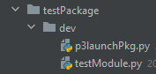
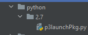

# p3launcher
a lite weight environment and package configuration tool. Inspired by rez

# Supported OS
1. windows

# How to use?

before you can use this tool, you have to deploy a p3launchPackage. Here are two packages that you can download and use.
1. python (this is a good example of how you can bind 3rd party applications)
2. testPackage (this is a good exapmple of how you can convert existing repository into p3launchPakcages)

NOTE: every p3launchPackage must have version folder, if its development repo then the version should be dev. See images:

**Dev Package**



**Deployed Package**



## Steps
1. set env variable `PATH=%PATH%;your_p3launcher_dir` (do this only the first time)
2. run following commands in command prompt to get new terminal
   ```shell
   p3launch python-2.7 testPackage-dev
   ```
3. run following commands to run python application
   ```shell
   python
   ```
3. run following commands to execute testModule.py in this terminal
   ```python
   import testModule
   ```
